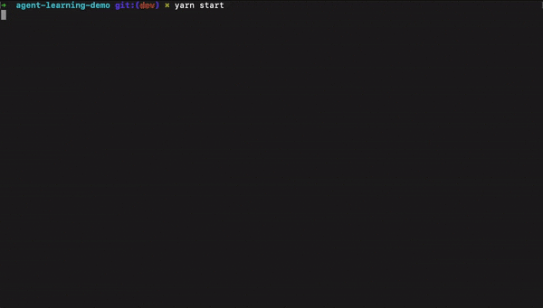

# GPT Agent Learning Demo


PolyGPT is an autonomous agent that learns new capabilities on-demand. The project utilizes Polywrap to implement capabilities as dynamically fetchable WebAssembly modules called Wraps, which update the agent via OpenAI's Functions API. This approach ensures that the agent remains efficient and lightweight, while having access to a wide range of capabilities. Current capabilities include web scraping, local filesystem access, Ethereum transactions, and more.

Mark the repo with a Star ⭐ if you like it!
---


# Getting started
Open your terminal window and run the following commands
1. `git clone https://github.com/polywrap/gpt-agent-learning-demo.git`
2. Update your .env file with the appropriate keys for OpenAI and reconfigure your agent if needed
3. `yarn install` will get all dependencies installed
4. `yarn start` will run the agent loop

Then you can start interacting with the bot by filling in the main goal, and then an initial Prompt.

## Example Goals:

The bot will initially request a main goal to achieve, here are some examples:

| Prompt                                                      | Learned Wraps    | Example                          |
|-------------------------------------------------------------|------------------|----------------------------------|
| Tell me what the potential user market of https://polywrap.io is, and write your findings to a summary.md file  | web-scrapper, http, file-system   | [LINK](example-chat-logs/07-12-webscraper-research.md)             |
| Create an express server, add a route called ‘counter’ which increments every time you ping it, and run this server | file-system, child-process       | [LINK]()     |
| Read the PDF textbook.pdf, summarize its contents, and write the results to summary.pdf | file-system, pdf                | [LINK](<summary.pdf>)             |
| Get the Bitcoin price from https://api.coindesk.com/v1/bpi/currentprice.json | web-scrapper, http               | [LINK](example-chat-logs/07-12-http-bitcoin-price.md)     |
| Read the file at some-domain.eth                              | Ethereum, ipfs, http             | [LINK]()     |
| How much ETH does example.eth have?                       | ENS, Ethereum                    | [LINK](example-chat-logs/07-12-ens-ethereum-balances.md)     |

## Autopilot Mode 

To enable Autopilot and let the model execute freely the next operations sent the Prompt: `auto -N` where `N` is the amount of automatic stepts you want the agent to take.

This command will trigger mostly execution steps where the agent loads wrappers and executes theirs functions.

We recommend oversight of the Autopilot mode as it will probably steer away from its main goal or waste tokens when it goes on loops.

## Chat Logs

The bot should be outputting conversations in a [`chat.md`](/chats/) file with the entire chat history to be easily shared with the community. To find this file check the chats folder after running the agent.


# Key Concepts
## Wraps
Wraps are groups of methods that the agent can execute on demand. They are the core components of the Polywrap framework, designed to be portable and composable. This means they can run in any environment and can easily and safely call into one another.

The agent first needs to `LoadWrap` in order to learn its methods, and then it can `InvokeWrap` to execute them.

Before an agent can use a Wrap, it first needs to load it. This process allows the agent to learn the methods and capabilities of the Wrap. This is done using the LoadWrap function.

Once a Wrap is loaded, the agent can then invoke it to execute its methods. This is done using the InvokeWrap function.


Wraps are developed in a standardized way, allowing them to be easily composed, resulting in even more sophisticated Wraps. They can run on any platform that has the Polywrap client installed. Wraps do not have to be bundled into applications. Instead, they can be safely fetched and run at runtime, allowing applications to stay in-sync with web3 protocol upgrades. This makes it possible for applications on any platform, written in any language, to read and write data to Web3 protocols.

## Wrap Library

All wraps are stored in a [Wrap Library](./wraps/) which will be maintained in parallel, adding more commands to the agent on startup.

## Functions 

The agent consists of only 2 versatile functions that are exposed to the user. They leverage the polywrap client and showcase its versatility.

### LoadWrap(name:string)

The `LoadWrap` function fetches a wrap from the library using its `name`, allowing the agent to access its methods. Once a wrap is loaded, the agent can provide you with information on how to interact with it. Note that loading a new wrap will replace the currently loaded wrap.

```
Prompt: Load the http wrap

Do you wish to execute the following function?

    Name: LoadWrap
    Arguments: {
  "name": "http"
}

    (Y/N)
```


### InvokeWrap(options: object)
The `InvokeWrap` function calls a method from the loaded wrap using the [`PolywrapClient`](https://github.com/polywrap/javascript-client). The function takes an `options` object which must include a `uri` and a `method`. You can also pass `args` in the `options` object that will be used by the selected method.
```
Prompt: Invoke the GET method wit the url https://api.example.com/data

Do you wish to execute the following function?

    Name: InvokeWrap
    Arguments: {
  "uri": "wrap://plugin/http@1.1.0",
  "method": "get",
  "args": {
    "url": "https://api.example.com/data",
    "request": {
      "headers": {
        "Content-Type": "application/json"
      }
    }
  }
}

    (Y/N)
```

  

# Memory: Rolling summary

This agent uses a simple rolling memory which keeps track of the most recent messages in a short `summary.md` in the workspace. This file helps the bot keep on track towards its goals and also being aware of the previous taken steps.

In order to reset the memory you can always `yarn start --wipe-memory`

To see the implementation of the module check [`memory.ts`](./src/memory.ts)

Configure the size of the rolling summary in the `.env`. We recommend a setting a minimum of 1000 and a maximum 3000 if you're using `gpt-3.5-turbo-0613` or 5000 with `gpt-4-0613` as your base model.

# Ethereum Integrations

To interact with the Ethereum Network using PolyGPT you can optionally add your Ethereum Private Key to the `.env` file.
 
 **Warning:** PolyGPT is still a prototype and we can't guarantee the precense of errors when the agent is invoking arguments, and having your private key written in plain text is not a good practice, so we highly recommend you only add a private key to a dummy accounts which only have funds that you're willing to lose.

# Collaborating

We are eager to work with the community to continue improving this agent. If you're interested in contributing, we welcome Pull Requests! Here are some ways you can contribute:

- **Bug Fixes:** If you spot a bug or an error, feel free to fix it and submit a PR. Please include a description of the bug and how your code fixes it.
- **Feature Additions:** We are open to new features! If you have an idea, please share it on our [discord](https://discord.com/invite/Z5m88a5qWu) first. That way, we can discuss it as a community. If the idea is approved, you can go ahead and add it.
- **Documentation:** Good documentation makes for a good project. If you spot areas in our docs that can be improved, or if something is not documented and should be, feel free to make these changes.

Remember, the best way to submit these changes is via a Pull Request. If you're new to Github, you can learn about PRs [here](https://docs.github.com/en/github/collaborating-with-issues-and-pull-requests/about-pull-requests).

Also, please feel free to join our [discord](https://discord.com/invite/Z5m88a5qWu) and discuss your ideas or ask any questions. We are an open, welcoming community and we'd love to hear from you!

## Limitations

Please remember that this is still an early prototype and while using it normally you will certainly hit some of it's limitations.

We highly recommend using the `gpt-4-0613` model as it will increase the context window lenght and handle a lot more errors for you automatically instead of breaking like `gpt-3.5-turbo-0613`. The GPT 4 model will be available to more accounts [soon](https://openai.com/blog/gpt-4-api-general-availability).

# Debugging

To run in debug mode just run 

  `yarn start --debug`

By default the agent will output a `chat-history.txt` which is constantly updated with the current state of the chat history being sent to the agent on each chat completion. This is useful specially because the memory module makes edits the conversation history constantly and the chat logs that you get as output are different from the chat conversation

# Resources and Links

[Discord](https://discord.com/invite/Z5m88a5qWu)  |  [Wrap Library](https://github.com/polywrap/agent-wrap-library)  |  [Polywrap Docs](https://docs.polywrap.io)  |  [ChatGPT Docs](https://platform.openai.com/docs/guides/gpt/function-calling)
